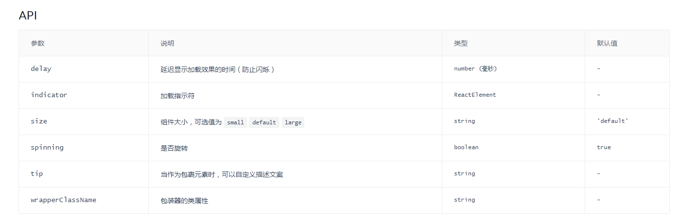

# dingyi spin 加载插件
# api
参数	说明	类型	默认值  
delay	延迟显示加载效果的时间（防止闪烁）	number (毫秒)	-  
indicator	加载指示符	ReactElement	-  
size	组件大小，可选值为 small default large	string	'default'  
spinning	是否旋转	boolean	true  
tip	当作为包裹元素时，可以自定义描述文案	string	-  
wrapperClassName	包装器的类属性	string	-  

 